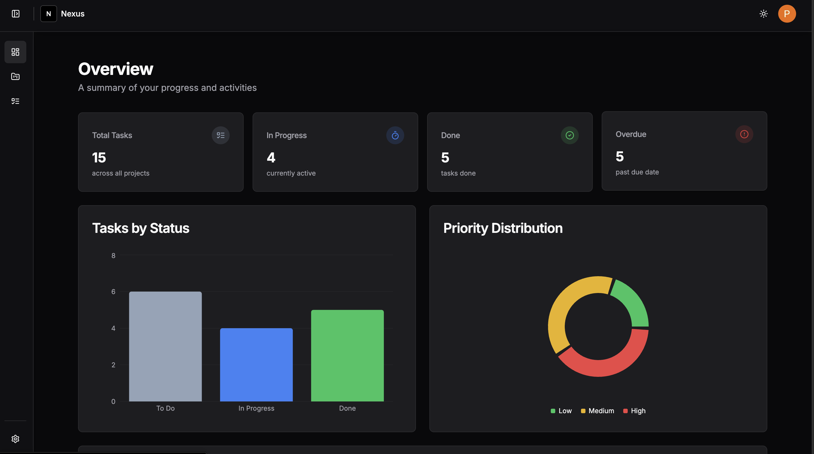

# Nexus
### Project & Task Management

A full-stack project management application built with Next.js, featuring authentication, task tracking, Kanban board, and data visualization.



## Tech Stack

- **Framework:** Next.js 15 (App Router, Server Components, Server Actions)
- **Language:** TypeScript
- **Auth:** Auth.js v5 (NextAuth) with Google OAuth + Credentials
- **Database:** PostgreSQL via Prisma ORM (Neon)
- **Styling:** Tailwind CSS + shadcn/ui
- **Email:** Nodemailer via Gmail SMTP
- **Testing:** Jest (unit + integration)

## Features

- Credential and Google OAuth authentication
- Password reset flow with email verification
- Rate limiting on auth endpoints
- Protected routes via Edge middleware
- Dark/Light theme
- Kanban board per project
- Dashboard with charts and analytics
- Task filtering, pagination, and tagging
- Responsive layout with mobile drawers

## Getting Started

### Prerequisites

- Node.js 18.17+
- PostgreSQL (local or cloud via Neon/Supabase/Railway)

### Installation

```bash
git clone https://github.com/patriciasegantine/nexus-app.git
cd nexus-dashboard
npm install
```

### Environment variables

```bash
cp .env.example .env
```

Required variables:

```env
DATABASE_URL=

AUTH_SECRET=
AUTH_GOOGLE_ID=
AUTH_GOOGLE_SECRET=
NEXTAUTH_URL=

GMAIL_USER=
GMAIL_APP_PASSWORD=
EMAIL_FROM=
```

### Database

```bash
npm run prisma:migrate
```

### Running

```bash
npm run dev        # development (port 4000)
npm run build      # production build
npm run start      # production server
```

### Tests

```bash
npm test              # Jest unit + integration tests
npm run test:watch    # Jest in watch mode
```

## Project Structure

```
src/
├── app/
│   ├── (auth)/          # login, register, forgot/reset password
│   └── (dashboard)/     # protected pages (projects, tasks, overview)
├── actions/             # Server Actions (auth, tasks, projects, settings)
├── auth/                # Auth.js config (Edge-safe)
├── components/          # UI components grouped by domain
│   ├── ui/              # shadcn/ui primitives + shared components
│   ├── tasks/           # task-card, task-dialog, filters, tags
│   ├── projects/        # project-card, kanban
│   ├── overview/        # dashboard charts and stats
│   └── ...
├── constants/           # App-wide constants
├── contexts/            # React contexts
├── hooks/               # Custom hooks
├── lib/                 # DB client, mail, rate limiting, utilities
├── types/               # TypeScript types
└── validations/         # Zod schemas
```

## Architecture

This project follows a **Server-first** architecture using Next.js App Router:

- **Data fetching** — React Server Components query the database directly via Prisma
- **Mutations** — Server Actions with Zod validation and `revalidatePath` for cache invalidation
- **Auth** — Auth.js v5 with Edge-compatible middleware for route protection
- **Email** — Nodemailer dispatched directly from Server Actions (no webhook layer)
- **IDOR protection** — all queries scoped by `userId`

---

## Migration Notes

This project started as a **client-only frontend** consuming an external REST API, using React Query for data fetching and Axios for HTTP calls.

It has since been fully migrated to a **fullstack Next.js application**:

| Before | After |
|---|---|
| External REST API | Prisma + PostgreSQL directly |
| React Query | Server Components + `revalidatePath` |
| Axios | Server Actions |
| API webhook for email | Nodemailer in Server Actions |
| Co-located page components | Domain-grouped components |

---

Created with ❤️ by Patricia Segantine
